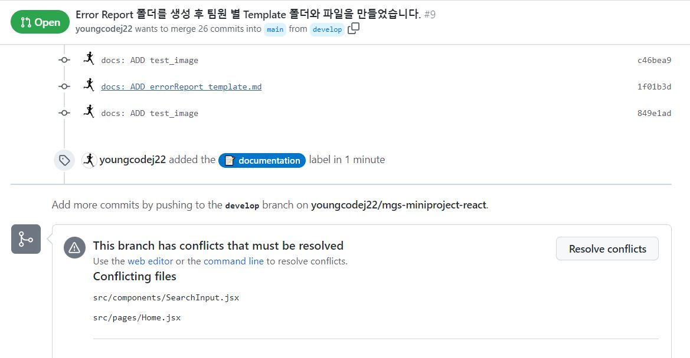
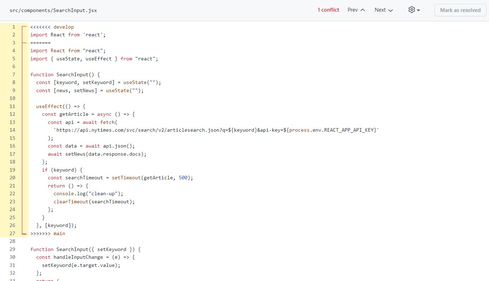
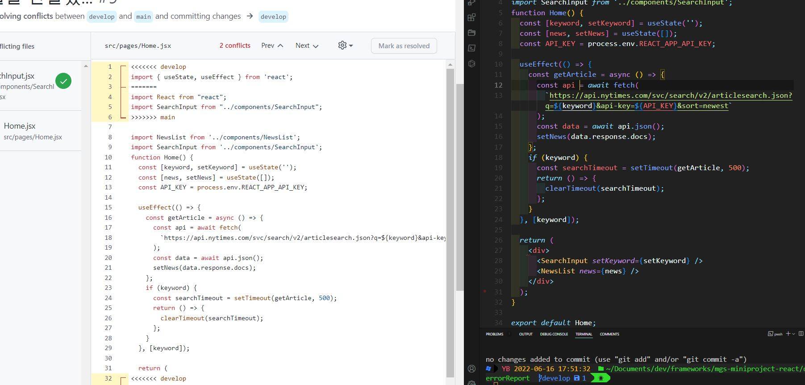
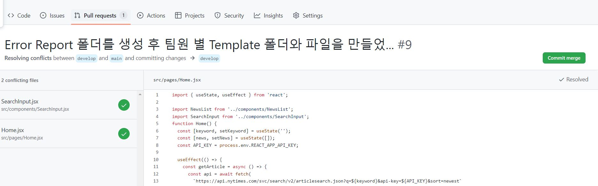
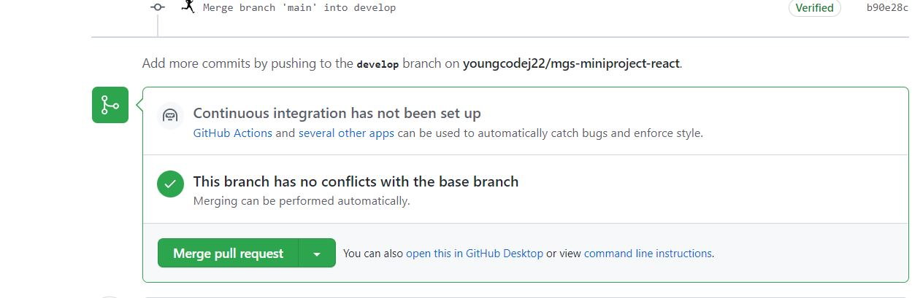

# Error Report

### Summary

- docs/errorReport 폴더를 생성, 팀원들의 폴더를 생성하여 template파일을 만들었다.
- develop branch로 `push`를 한 후 Github 웹에서 develop branch의 내용을 main branch로 merge를 하는 중에 `conflict`가 발생하였다.

### ScreenShot
1. conflict 발생 현황

2. conflict가 발생하면 **노란색 부분을 수정해야한다.**

3. 보시다시피 local에 있는 코드를 보면서 Github 웹에 있는 노란색 부분을 삭제하였다. 그렇게 하니 노란부분 없이 하얀색으로 만들어졌다. 다 완료되면 **Mark as resolved** 버튼을 누른다.

4. 완료가 된후 초록색 **commit merge**버튼을 클릭한다.

5. 이후 수정된 부분에 대한 comment를 작성한 후 **Merge pull request**를 클릭하여 종료.

### How to solve

- 스크린샷에 나온 봐야 같이 local에 있는 코드와 비교하면서 노란색(conflict)부분을 수정/삭제한다.
