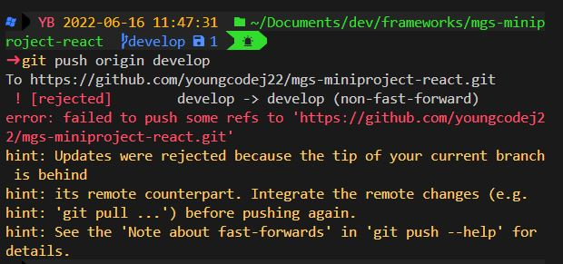

# Error Report

### ScreenShot

### Summary

- Remote Repository에 팀원들이 PR을 보낸 후 Merge 한 상태였다.
- 나는 `pull`을 하지 않고 내가 업데이트한 문서를 먼저 `push`하였다.
- 그래서 다음과 같은 Error가 발생하였다.

### How to solve

- `hint`에서 `before pushing again`보다시피 `push`를 하기 전에 `git pull ...`을 하라고 알려주고 있다.
- 결국 remote repository의 최신 코드를 `pull`을 통해 받고 `push`를 수행하도록 하자.
