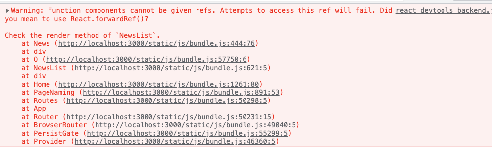

# Error Report

### ScreenShot

부모컴포넌트에서 자식컴포넌트의 DOM엘리먼트를 참조 하고 싶을때

```jsx
// NewsList Component
const NewsList = ({ news, lastCardNewsRef }) => {
  return (
    <Container>
      {news.map((newsData, idx) => {
        return <News ref={lastCardNewsRef} />;
      })}
    </Container>
  );
};
```

```jsx
// News Component

const News = (props) => {
  return (
    <Card ref={props.ref}>
      <h2>{props.headline}</h2>
    </Card>
  );
};

export default News;
```



- 함수 컴포넌트는 인스턴스가 없기 때문에 ref어트리뷰트를 사용할 수 없다

https://ko.reactjs.org/docs/forwarding-refs.html#forwarding-refs-to-dom-components

### Summary

`ref`

- ref는 특정 DOM (Html)을 참조 할 때 사용 한다
- ref는 리액트 예약어이다 (ex: key, className)
- 함수 컴포넌트는 인스턴스가 없기 때문에 ref어트리뷰트를 사용할 수 없다
- 간단하게는 ref의 이름을 myRef 같은 이름으로 수정하여 해결 할 수 있다
- 또는 리액트훅 forwardRef를 이용해 ref 참조 값을 사용 할 수 있다

### How to solve

1. ref 이름 변경

```jsx
// NewsList Component
const NewsList = ({ news, lastCardNewsRef }) => {
  return (
    <Container>
      {news.map((newsData, idx) => {
        return (
          <News myRef={lastCardNewsRef}
            ✅ // myRef 이름으로 컴포넌트에 전달
          />
        );
      })}
    </Container>
  );
};
```

```jsx
// News Component

const News = (props) => {
  return (
    <Card ref={props.myRef}>
      ✅ // props로 myRef
      <h2>{props.headline}</h2>
    </Card>
  );
};

export default News;
```

2. forwardRef hooks

```jsx
// NewsList Component
const NewsList = ({ news, lastCardNewsRef }) => {
  return (
    <Container>
      {news.map((newsData, idx) => {
        return (
          <News ref={lastCardNewsRef}
            ✅ // ref 그대로 사용
          />
        );
      })}
    </Container>
  );
};
```

```jsx
// News Component
import React, { forwardRef } from 'react';

const News = forwardRef((props, ref) => {
             ✅ // forwardRef 사용
  return (
    <Card ref={ref}>
           ✅ // ref 사용
      <h2>{props.headline}</h2>
    </Card>
  );
});

export default News;
```
